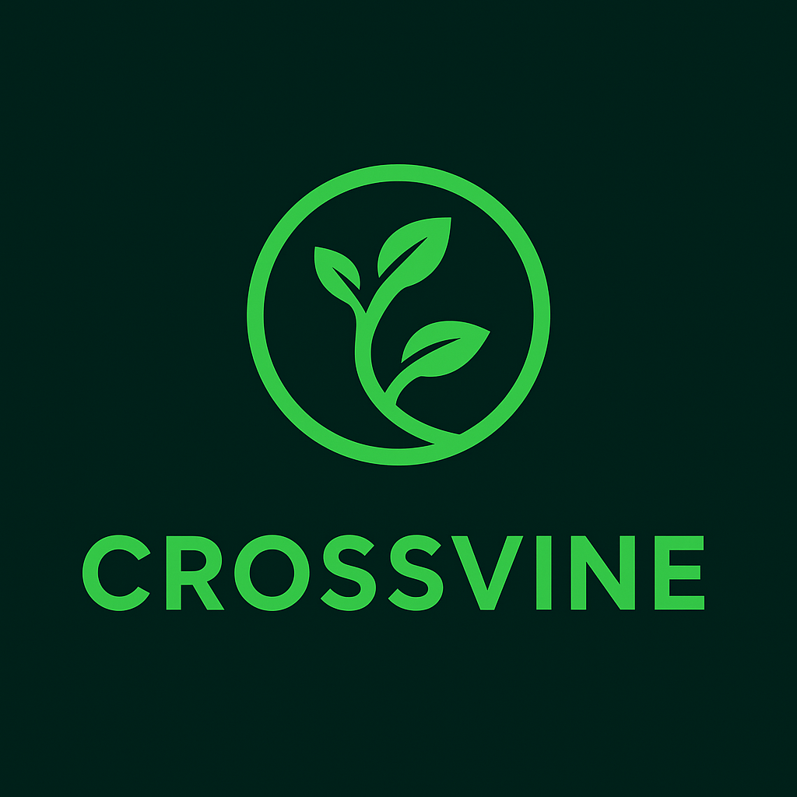

# 🌿 Crossvine Frontend

A modern, interactive social media platform frontend built with vanilla HTML, CSS, and JavaScript. Crossvine features a clean design with dynamic theming, media management, and real-time user interactions.



## 🚀 Features

### 🎨 **User Interface**

- **Dual Theme Support**: Light and Dark mode with smooth transitions
- **Responsive Design**: Works seamlessly across desktop and mobile devices
- **Modern UI**: Clean, professional interface with gradient styling
- **Interactive Elements**: Smooth animations and hover effects

### 👤 **User Management**

- **Registration System**: Complete user signup with profile customization
- **Login/Authentication**: Secure user authentication system
- **Profile Pages**: Personalized user profiles with engagement metrics
- **User Search**: Find users by username or hashtags

### 📱 **Social Features**

- **Post Creation**: Rich text posts with hashtag support
- **Media Upload**: Support for images, videos, and audio files
- **Like/Dislike System**: Interactive engagement on posts
- **Hashtag System**: Trending and saved hashtags
- **Real-time Feed**: Dynamic post filtering and sorting

### 🔧 **Advanced Features**

- **Media Manager**: Comprehensive file upload and preview system
- **Storage System**: Local data persistence with compression
- **Search & Filter**: Advanced post filtering by media type, date, and engagement
- **Modular Architecture**: Clean, maintainable JavaScript modules
- **💥 Nuke Feature**: Admin-level content management (delete all posts/users)

## 📁 Project Structure

```
crossvine-FRONTEND/
├── 📄 demo1.html           # Main homepage
├── 📄 demoProfile1.html    # User profile page
├── 📄 demoRegister1.html   # User registration page
├── 📄 media-demo.html      # Media demonstration page
├── 🎨 demo1.css           # Main stylesheet
├── 📂 js/                 # JavaScript modules
│   ├── app.js             # Main application logic
│   ├── auth-manager.js    # Authentication handling
│   ├── user-manager.js    # User management
│   ├── posts-manager.js   # Post creation and management
│   ├── media-manager.js   # File upload and media handling
│   ├── theme-manager.js   # Dark/Light theme switching
│   ├── storage-manager.js # Local storage management
│   ├── ui-manager.js      # UI updates and interactions
│   └── utilities.js       # Helper functions
├── 📂 IMG/               # Image assets
│   ├── LOGO.png          # Main logo
│   ├── LightMode.png     # Light theme background
│   ├── DarkMode.png      # Dark theme background
│   └── smaller.png       # Navigation logo
└── 📚 Documentation/
    ├── README-MODULAR.md
    └── POST-FILTERING-SYSTEM.md
```

## 🛠️ Installation & Setup

### Prerequisites

- Modern web browser (Chrome, Firefox, Safari, Edge)
- Python 3.x (for local development server)
- Git (for version control)

### Quick Start

1. **Clone the Repository**

   ```bash
   git clone https://github.com/CJones2025/crossvine-FRONTEND.git
   cd crossvine-FRONTEND
   ```

2. **Start Local Server**

   ```bash
   python -m http.server 8000
   # or
   python3 -m http.server 8000
   ```

3. **Open in Browser**
   Navigate to: `http://localhost:8000/demo1.html`

### Alternative Setup

- Simply open `demo1.html` in your browser (some features may be limited without a server)

## 🎯 Usage Guide

### Getting Started

1. **Homepage**: Start at `demo1.html` to explore the main feed
2. **Register**: Create an account via the registration page
3. **Login**: Use the dropdown login in the top navigation
4. **Create Posts**: Use the post creation form with media upload
5. **Explore**: Browse posts, use hashtags, and interact with content

### Key Pages

- **`/demo1.html`** - Main homepage and feed
- **`/demoProfile1.html`** - User profile and statistics
- **`/demoRegister1.html`** - New user registration
- **`/media-demo.html`** - Media upload demonstration

### Special Features

- **Theme Toggle**: Switch between light/dark modes in the sidebar
- **Search**: Use the top search bar to find users, hashtags, or keywords
- **Filters**: Sort and filter posts by various criteria
- **💥 Nuke Button**: Admin feature to clear all content (bottom-right corner)

## 🏗️ Architecture

### Modular Design

The project follows a modular architecture pattern:

- **Separation of Concerns**: Each module handles specific functionality
- **Event-Driven**: Uses DOM events for component communication
- **Storage Abstraction**: Centralized data management
- **Theme System**: CSS custom properties for dynamic theming

### Key Modules

- **Auth Manager**: Handles login/logout and session management
- **User Manager**: Manages user data and profiles
- **Posts Manager**: Creates, displays, and manages posts
- **Media Manager**: Handles file uploads and media processing
- **Storage Manager**: Manages local data persistence

## 🎨 Customization

### Themes

Modify CSS custom properties in `demo1.css`:

```css
:root {
  --bg-image: url("IMG/LightMode.png");
  --sidebar-bg: #1e8449;
  --topbar-bg: #2d5a3d;
  --main-content-bg: rgba(236, 240, 241, 0.7);
}
```

### Adding Features

1. Create new JavaScript module in `/js/`
2. Include in `demo1.html` with `defer` attribute
3. Initialize in `app.js` DOMContentLoaded event
4. Add corresponding CSS styles

## 🤝 Contributing

### Development Workflow

1. Fork the repository
2. Create a feature branch: `git checkout -b feature-name`
3. Make your changes
4. Test thoroughly
5. Commit with clear messages: `git commit -m "Add feature description"`
6. Push and create a Pull Request

### Code Standards

- Use meaningful variable and function names
- Add comments for complex logic
- Follow existing code style and structure
- Test across multiple browsers
- Maintain responsive design principles

## 🐛 Known Issues & Limitations

- Local storage has browser limits (typically 5-10MB)
- Media files are stored as base64 (increases storage usage)
- Real-time features require server implementation
- Some features may not work when opening files directly (use local server)

## 🔮 Future Enhancements

- [ ] Backend integration with REST API
- [ ] Real-time notifications and messaging
- [ ] Advanced user roles and permissions
- [ ] Mobile app version
- [ ] Enhanced media processing
- [ ] Social features (follow/unfollow, comments)
- [ ] Content moderation tools

## 📄 License

This project is open source and available under the [MIT License](LICENSE).

## 👥 Contributors

- **CJones2025** - Initial development and maintenance

## 📞 Support & Contact

- **GitHub Issues**: [Report bugs or request features](https://github.com/CJones2025/crossvine-FRONTEND/issues)
- **Repository**: [https://github.com/CJones2025/crossvine-FRONTEND](https://github.com/CJones2025/crossvine-FRONTEND)

---

## 🌟 Screenshots

### Light Mode


### Dark Mode


---

**Made with ❤️ for the developer community**

_Capstone project Crossvine 2025 - Frontend_
